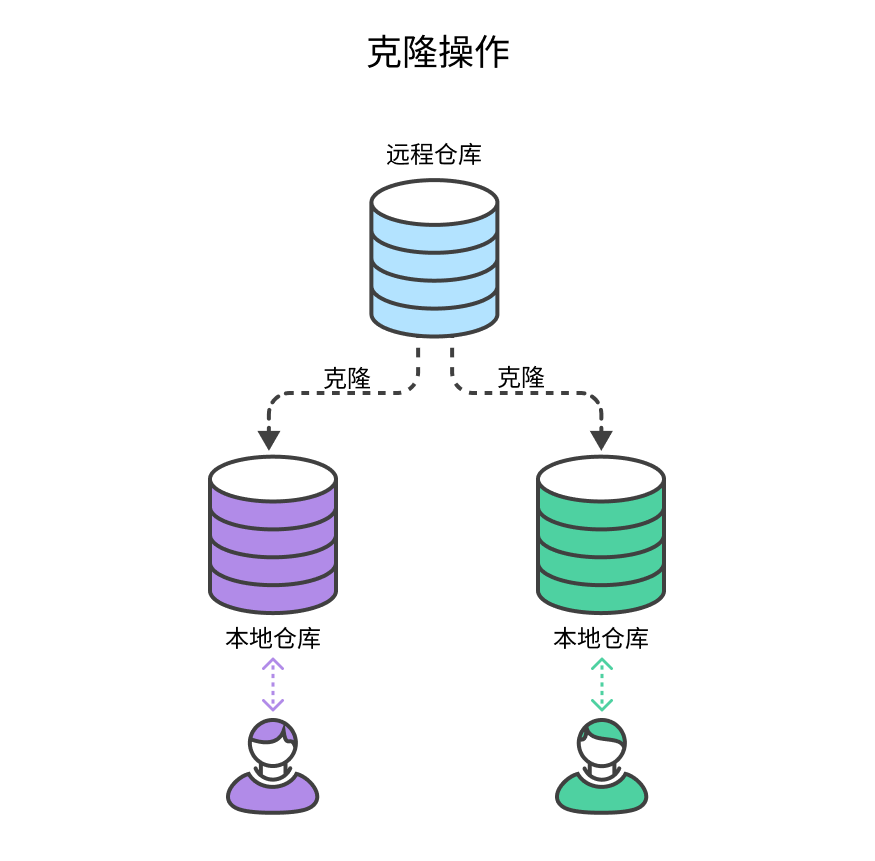

# Git常见操作


## 仓库相关


### 克隆远程仓库

将远程服务器的仓库复制到本地的操作被称为克隆，克隆操作通常是一次性的，一旦开发人员获得了远程仓库的工作副本，之后所有版本控制操作和协作都通过其本地仓库进行管理。



```shell
git clone [--branch <tag>] [-depth=<number>] <repo_url> [<dir>]
```


### 初始化本地仓库


### 设置仓库


## 管理Git凭证

对于一些私有的Git仓库每次操作都需要验证账户密码，这无疑是非常麻烦的，因此我们可以使用Git Credential Manager（GCM）凭据管理器来管理多个Git仓库的凭据，并享受自动化的身份验证体验。


### 下载MacOS版

选择以下方式之一在MacOS上安装 GCM：

- 下载[GCM安装程序](https://github.com/git-ecosystem/git-credential-manager/releases)

- 使用Homebrew

  ```shell
  $ brew install --cask git-credential-manager
  ```


### 下载Windows版

GCM 包含在[Windows 版 Git](https://gitforwindows.org/)中，在安装过程中，系统会要求您选择一个凭据助手， GCM 默认包含。


当然你也可以下载[GCM安装程序](https://github.com/git-ecosystem/git-credential-manager/releases)单独安装。


### 下载Linux/Unix版

[详情点击链接查看](https://github.com/git-ecosystem/git-credential-manager/blob/release/docs/install.md#linux)


### 使用

打开终端并输入以下命令即可配置 Git 使用 GCM 作为凭据助手，享受自动化的身份验证体验！

```shell
git config --global credential.helper manager-core
```

GCM会在你首次与一个 Git 仓库完成身份验证后，安全地存储你输入的凭据，后续当仓库需要再次身份验证时，GCM 将自动提取并使用存储的凭据，而无需再次输入密码。