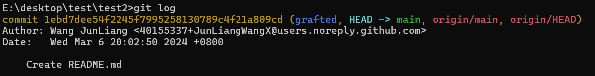

# Git常见操作


## 设置仓库


### 初始化本地仓库（init）

我们可以使用`git init`命令在当前或指定目录中初始化一个新的本地仓库，创建`.git`目录并设置仓库的基本配置。初始化仓库完成后，你可以使用其他 Git 命令来进行版本控制、提交更改以及与远程仓库进行交互。


#### **命令**

```shell
git init [<dir>] [--template=<template_directory>]
```

- `<dir>`（可选）：指定需要初始化仓库的本地位置，如果不指定则默认为命令执行的当前目录。
- `--template=<template_directory>`（可选）：使用指定的模板目录来初始化仓库，模板目录包含了初始化仓库时所需的默认文件和配置。


#### 示例

> 初始化本地仓库

```shell
git init ./init_example
```

命令执行完成后即可看到`init_example`目录下有一个`.git`目录


### 克隆远程仓库（clone）

将远程服务器的仓库复制到本地的操作被称为克隆，克隆操作通常是一次性的，一旦开发人员获得了远程仓库的工作副本，之后所有版本控制操作和协作都通过其本地仓库进行管理。


#### **命令**

```shell
git clone [--branch <tag>] [--depth=<number>] <repo_url> [<dir>]
```

- `--branch <tag>`（可选）：通过指定 `<tag>` 来克隆仓库的特定分支。如果不指定则将克隆仓库的所有分支。

- `--depth=<number>`（可选）：通过指定 `<number>` 来限制克隆的深度，即需要克隆的仓库的提交记录数量，这也被称为浅克隆。如果不指定则将克隆完整的提交记录。

  ::: tip 为何需要浅克隆？

  因为如果克隆的仓库存在大量的提交记录（例如千万条），克隆全部的提交记录则会导致克隆时间增加并且也会增加仓库占用的硬盘空间，而且较为久远的提交记录并无太大作用。

  :::

- `<repo_url`（必须）：指定需要克隆的仓库地址。

- `<dir>`（可选）：指定将克隆的仓库存放在本地的位置，如果不指定则默认为命令执行的当前目录。


#### 示例

> 克隆仓库

```shell
git clone https://github.com/JunLiangWangX/mianshi.git
```

克隆完成则可以在命令执行的当前目录看到克隆的文件


> 克隆仓库特定分支

```shell
git clone --branch dev https://github.com/JunLiangWangX/mianshi.git
```

克隆完成后进入克隆的文件执行git branch命令则看到仅克隆了dev分支


> 浅克隆

```
git clone --depth 1 https://github.com/JunLiangWangX/mianshi.git
```

克隆完成后进入克隆的文件执行git log命令则看到仅克隆1条提交记录




## 分支相关操作


