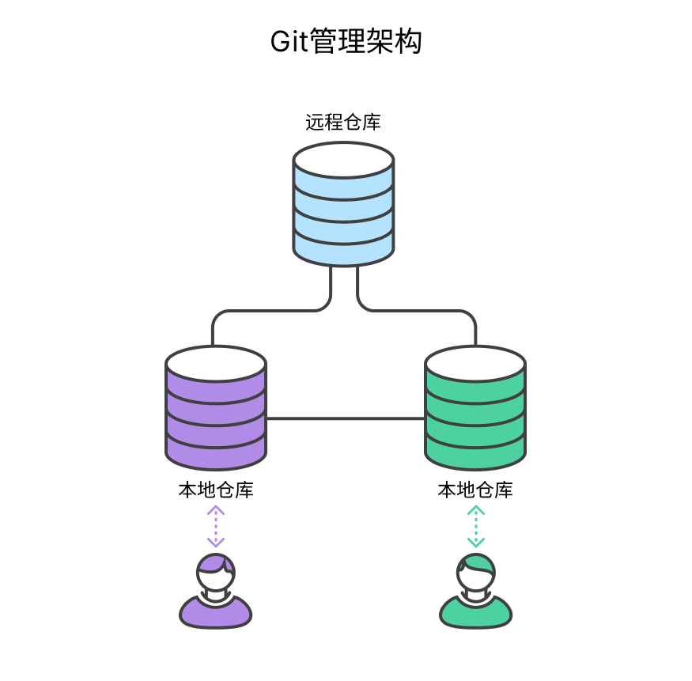

# Git介绍与安装

Git目前是世界上最受欢迎的版本控制系统，它由 Linux 操作系统内核的著名创建者 Linus Torvalds 于 2005 年开发。**Git 是一个分布式版本控制系统（DVCS）。每个开发人员都拥有自己的本地存储库，其种包含了完整代码以及完整的文件历史记录，开发者可以在本地进行修改和提交，也可以与其他开发者分享和同步代码变更。**




## Git的优缺点

Git是世界上最受欢迎的版本控制系统，它具有许许多多强大的优势：

- **更强大的性能：** Git在提交、分支、合并和比较等操作上进行了性能优化，利用文件树知识提高效率。它关注文件内容而不是文件名，并使用增量编码、压缩和明确存储目录内容和版本元数据对象来存储文件。
- **分布式开发：** Git 是一个分布式版本控制系统，每个开发人员都拥有自己的本地存储库，拥有完整的本地历史记录使得Git的速度更快，因为这意味着你无需网络连接就可以创建提交、检查文件的先前版本，或者在提交之间执行差异比较。
- **更安全：** Git通过SHA1算法保护文件内容和更改历史的完整性，确保源代码的真实历史记录
- **分支隔离：** Git 最大的优势之一是它的分支功能，分支为代码库的每次更改提供了一个隔离的环境，让开发人员能够并行完成开发工作。当开发人员想要开始做某件事时（无论大小）他们都会创建一个新分支，这确保了主分支始终不受影响，并且使用分支比直接编辑生产代码更可靠，而且还提供组织优势，它能够以您相同的工作粒度来表示开发工作。
- **更灵活：** Git具有灵活性，支持各种非线性开发工作流程，高效处理小型和大型项目，并与现有系统和协议兼容。
- **庞大的社区：** Git 是一个非常受欢迎的开源项目，拥有十多年的可靠管理，并且拥有庞大的开源社区支持，这意味着您可以轻松找到解决问题的答案，并且能够快速利用第三方库完成需求。

当然Git也并非全然完美，虽说是一个强大而受欢迎的版本控制系统，但同时也存在一些缺点：

- **学习曲线陡峭：** 对于初学者来说，Git的学习曲线可能很陡峭。理解Git的概念、命令和工作流程可能需要一定的时间和努力。初学者可能会感到困惑，尤其是在处理冲突、解决错误和执行高级操作时。
- **存储空间占用：** Git存储库的大小可能会比其他版本控制系统的存储库大。这是由于Git存储了完整的历史记录和元数据信息，包括每个提交的快照。对于非常大型的项目或存储库，这可能导致存储空间占用的增加。
- **合并冲突：** 在多人协作的项目中，当多个开发人员同时修改同一文件的相同部分时，可能会发生合并冲突。解决合并冲突可能需要一些手动操作，特别是当冲突较为复杂时。这可能需要开发人员花费额外的时间和精力来解决这些冲突。


## 安装Git


### 下载Windows版

选择以下方式之一在 Windows 上安装 Git：

- 下载最新的[Windows版Git安装程序](https://sourceforge.net/projects/git-for-windows.mirror/)

- 使用winget工具

  ```shell
  winget install --id Git.Git -e --source winget
  ```

  

### 下载MacOS版

选择以下方式之一在MacOS上安装 Git：

- 下载最新的[MacOS版Git安装程序](https://sourceforge.net/projects/git-osx-installer/)

- 使用Homebrew

  ```shell
  $ brew install git
  ```

- 使用MacPorts

  ```shell
  $ sudo port install git
  ```


### 下载Linux/Unix版

[详情点击链接查看](https://git-scm.com/download/linux)


### 验证是否安装成功

打开终端并输入以下命令验证安装是否成功：git --version

```shell
$ git --version
git version 2.9.2
```

