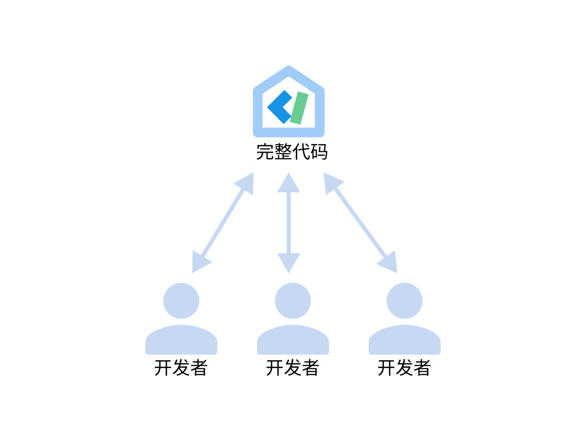
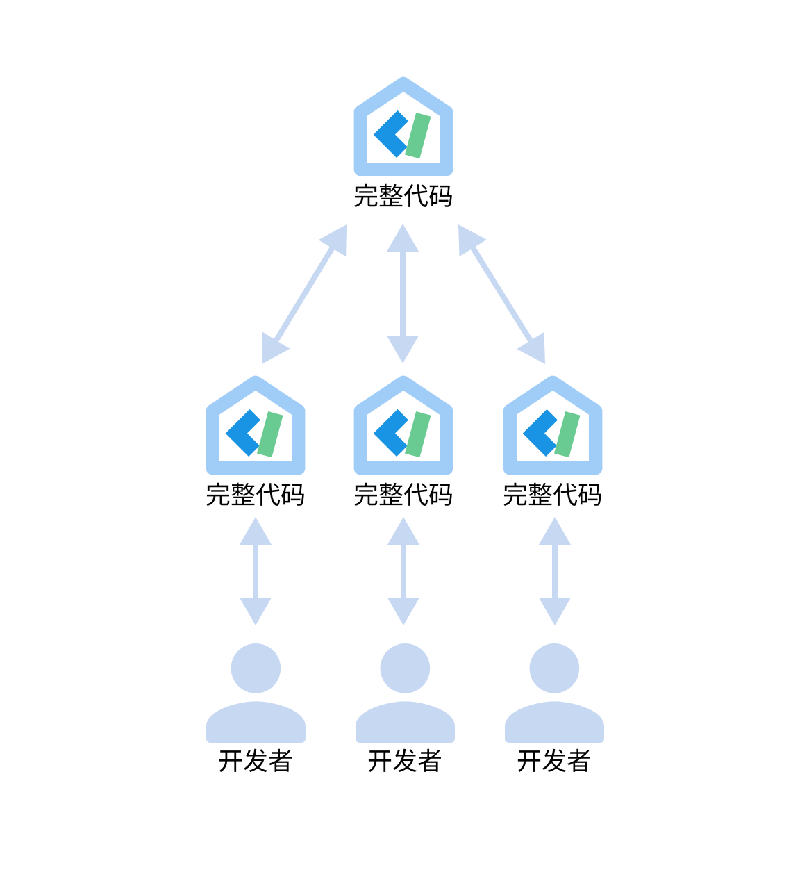
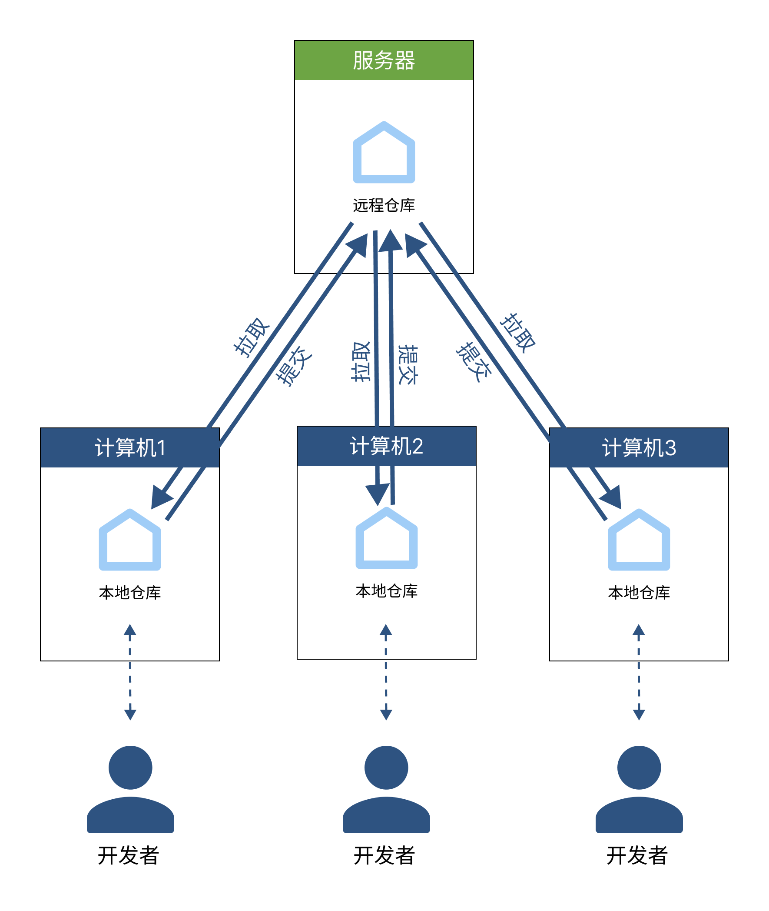

# 什么是版本控制系统

想必大家在多人开发时一定会遇到这样的问题：

- 每次集中合并大家的代码都要通过U盘、网盘等各类传输工具集中代码，非常麻烦。
- 在多人同时修改同一文件或相同部分代码时，可能会产生冲突，开发人员需要手动比较代码差异，检查新增和修改的内容，并进行手动合并。这样的过程很容易出错，并且耗费大量时间和精力。
- 很难追踪代码的修改历史和演变过程。无法准确知道某段代码的作者、开发时间以及具体的修改内容，这对于代码维护和问题排查都会带来困难。
- 因为误操作或错误想要回退到某个时期的代码。
- 如果代码丢失或者被覆盖，将会导致严重的问题，没有备份的代码可能无法恢复，导致数据丢失和开发进度延误。

版本控制系统就是为了解决上述问题而诞生的！

**版本控制系统（Version Control System，VCS）是一种用于跟踪和管理文件或代码版本的工具或系统。它使得开发人员可以更好地组织、协调和追踪代码的修改，提高团队的合作效率，减少错误和冲突，并为项目的可维护性和可靠性提供支持。**

## 版本控制系统的分类

版本控制系统有两种主要类型：**集中式版本控制系统（Centralized Version Control System，CVCS）**和**分布式版本控制系统（Distributed Version Control System，DVCS）**。

### 集中式版本控制系统

在集中式版本控制系统中，存在一个中央服务器，所有的文件版本都存储在该服务器上。开发人员从服务器上提取最新的版本，进行修改后再提交到服务器。这种系统的例子包括CVS（Concurrent Versions System）和SVN（Subversion）。

### 分布式版本控制系统

在分布式版本控制系统中，每个开发者都拥有完整的版本库，包括完整的文件历史记录。开发者可以在本地进行修改和提交，也可以与其他开发者分享和同步代码变更。这种系统的例子包括Git和Mercurial。

## 版本控制系统中的一些术语

### 仓库（Repository）

**仓库（Repository）在版本控制系统中是一个用于存储和管理文件版本的中央位置。** 仓库存储了项目的所有文件及其历史记录。每次进行提交操作时，版本控制系统会将修改的文件保存为一个新的版本，并将其添加到仓库中。通过存储每个版本的差异，仓库允许开发者在需要时回溯到特定的版本，查看文件的先前状态或恢复已删除的文件。

仓库可以是本地的或位于远程服务器上。本地仓库通常位于开发者的计算机上，用于记录和管理项目的版本。远程仓库则是一个位于网络上的中央存储库，供多个开发者协同工作和共享代码。

在分布式版本控制系统中，每个开发者都可以克隆远程仓库到本地，拥有完整的仓库副本。这样，开发者可以在本地进行修改和提交，并通过推送和拉取操作与远程仓库进行同步

### 分支（Branch）

在版本控制系统中创建的独立开发路径。分支允许开发人员在不影响主线开发的情况下进行并行开发、实现新功能或修复错误。分支可以合并回主线或其他分支。

### 标签（Tag）

在版本控制系统中，标签用于标记特定的版本，通常是重要的发布点或里程碑。标签可以使开发者轻松地回溯到特定版本，例如软件发布版本。

### 